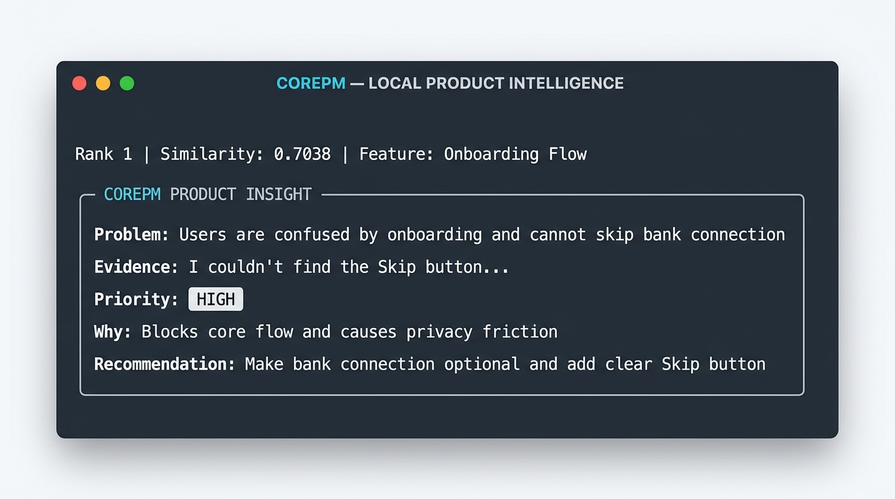
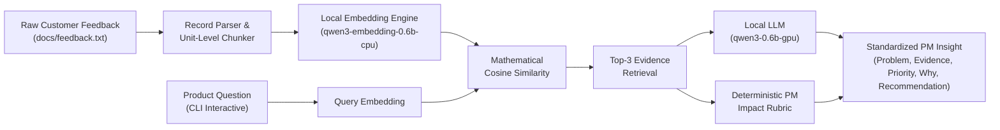

# CorePM — Local RAG Assistant for Product Teams

<p align="center">
  
  
  
  
</p>

<p align="center">
  
</p>

---

## Overview

**CorePM** is a local, privacy-first Retrieval-Augmented Generation (RAG) assistant designed for Product Managers. Developed as part of the Microsoft Summer School, it processes multi-user customer feedback, retrieves relevant evidence using local semantic vector search, and synthesizes structured, evidence-grounded product problem insights scored by a deterministic PM Impact Rubric.

All computations—including vector embeddings and generative inference—run **100% locally on-device** powered by **Microsoft Foundry Local** with Metal / WebGPU acceleration on Apple Silicon.

---

## Architecture & How It Works



1. **Multi-Record Feedback Ingestion**: Ingests unstructured feedback documents and robustly extracts `User ID`, `Feature`, and `Feedback` content.
2. **Unit-Level Semantic Chunking**: Keeps independent customer feedback units intact to preserve contextual integrity.
3. **Local Embedding Generation**: Computes 1024-dimensional dense semantic vectors using `qwen3-embedding-0.6b-generic-cpu:1`.
4. **Mathematical Cosine Similarity**: Evaluates vector similarity between product questions and customer feedback units.
5. **Top-K Retrieval**: Extracts the Top-3 highest-relevance evidence records along with associated metadata.
6. **Deterministic PM Impact Rubric**: Evaluates product severity objectively (High, Medium, Low) based on explicit PM impact criteria (financial loss, app crashes, privacy risks, onboarding blocks).
7. **Grounded Generative Synthesis**: Formulates concise, deduplicated, and hallucination-free PM insights with exact feedback citations.

---

## Deterministic PM Priority Rubric

Rather than relying entirely on freeform generation from small LLMs, CorePM couples LLM reasoning with an authoritative, rule-grounded PM prioritization rubric:

| Priority | Criteria & Signal Triggers | Example Scenarios |
| :--- | :--- | :--- |
| **HIGH** | • Direct financial/transaction failure<br/>• Mobile app crashes or infinite hangs<br/>• Explicit privacy/security concerns<br/>• Critical authentication/login blockage | Double charges on 3D Secure, app crash during payment, mandatory bank account connection without skip button |
| **MEDIUM** | • Significant onboarding or UX friction<br/>• Recurring complaints across multiple users on same feature<br/>• Degradation in core flows (search filter reset, 10s load lag) | Search returning unrelated results, repeated filter resetting, dashboard lag |
| **LOW** | • Minor convenience or cosmetic preferences<br/>• Notification volume / category preferences<br/>• Layout polish or small visual improvements | Notification frequency complaints, profile photo button layout |

---

## Features

- **100% Local & Private**: Customer data never leaves the local machine.
- **Dual Local Model Lifecycle**: Runs sequential model loading and unloading (`qwen3-embedding-0.6b` on CPU, then `qwen3-0.6b` on GPU/Metal) for optimal memory efficiency.
- **Sentence-Aware Parser**: Handles structured and unstructured feedback formats without breaking words or sentences.
- **Interactive Question Prompt**: Enter custom product queries or press Enter for instant default evaluation.
- **Strict Post-Processing**: Automatically eliminates `<think>` tokens, stray punctuation, LaTeX artifacts, and duplicated sentences.

---

## Example Output

```text
============================================================
COREPM PRODUCT INSIGHT
============================================================
Priority determined using CorePM PM impact rubric.

Problem:
Users are confused by the onboarding flow and cannot skip the bank connection step.

Evidence:
"I couldn't find the 'Skip' button anywhere, so I was forced to connect my bank account before even seeing the dashboard."

Priority:
High

Why:
The issue creates both onboarding friction and a privacy concern before users reach the dashboard.

Recommendation:
Make the bank connection step optional and provide a clearly visible Skip action.
```

---

## Tech Stack

- **Language**: Python 3.12+
- **Local AI Framework**: [Microsoft Foundry Local](https://github.com/microsoft/foundry-local) (`foundry-local-sdk`)
- **Embedding Model**: `qwen3-embedding-0.6b-generic-cpu:1` (1024 dimensions)
- **Generative Model**: `qwen3-0.6b-generic-gpu:2` (WebGPU / Metal execution provider)
- **Vector Metric**: Cosine Similarity

---

## Demo Data

The included customer feedback dataset (`docs/feedback.txt`) consists of **15 synthetic demo feedback records** spanning onboarding, payments, checkout, search & filters, performance, transfers, and notifications.

---

## Run Locally

### Prerequisites

1. **Python Environment**:
   ```bash
   python -m venv corepm_env
   source corepm_env/bin/activate
   pip install -r requirements.txt
   ```

2. **Microsoft Foundry Local**:
   Ensure Microsoft Foundry Local is installed and running on your device, with the following models cached:
   - `qwen3-embedding-0.6b-generic-cpu:1`
   - `qwen3-0.6b-generic-gpu:2`

### Running the Application

```bash
python app.py
```

- When prompted, press **Enter** to run the default question (*"What problems are users experiencing during onboarding and what should the product team prioritize?"*), or type any custom product question.

---

## License

This project is licensed under the MIT License - see the [LICENSE](LICENSE) file for details.
